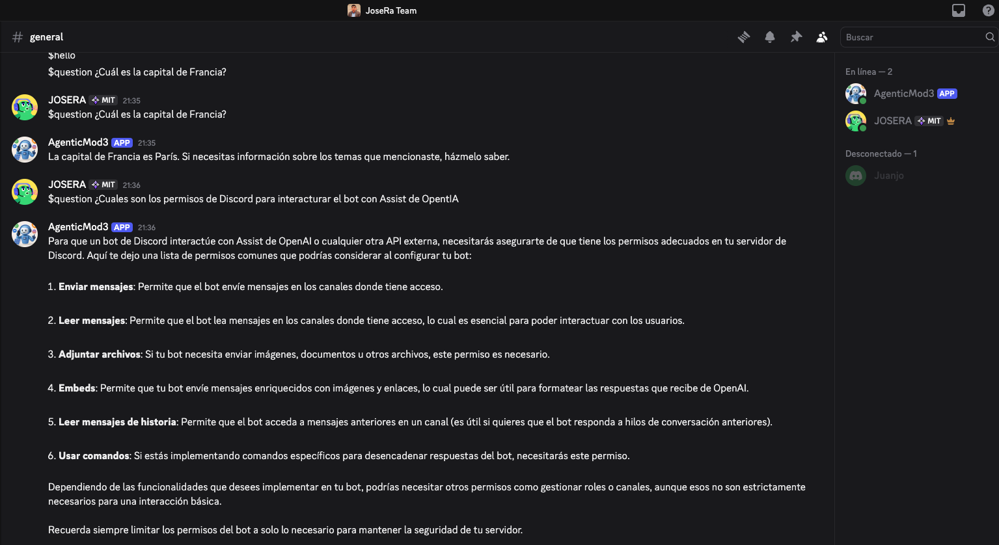

# Bot de Discord con OpenAI Assistant

Este proyecto implementa un bot de Discord que responde preguntas usando el Assistant API de OpenAI. El bot está en `botopenAI.py` y responde a mensajes que comienzan con `$question`.

## 📋 Características

- Responde al comando `$hola` mencionando al usuario
- Configuración segura usando variables de entorno
- Estructura modular y fácil de extender

## 🛠️ Requisitos del Sistema

- Python 3.8 o superior
- pip (administrador de paquetes de Python)
- Una cuenta de Discord y una aplicación de bot configurada

## 📦 Dependencias

- discord.py
- openai
- python-dotenv

Instala todas las dependencias con:
```bash
pip install -r requirements.txt
```
O manualmente:
```bash
pip install discord.py openai python-dotenv
```

## 🚀 Instalación y Configuración

### 1. Clonar el repositorio

```bash
git clone <URL_DEL_REPOSITORIO>
cd bot-discord
```

### 2. Crear un entorno virtual

```bash
# Crear entorno virtual
python3 -m venv .venv

# Activar entorno virtual
# En macOS/Linux:
source .venv/bin/activate

# En Windows:
# .venv\Scripts\activate
```

### 3. Instalar dependencias

```bash
pip install -r requirements.txt
```

### 4. Configurar variables de entorno

1. Crea un archivo `.env` en la raíz del proyecto:

```bash
touch .env
```

2. Agrega tu token de Discord y la API key de OpenAI al archivo `.env`:

```env
DISCORD_TOKEN=tu_token_de_discord
OPENAI_KEY=tu_api_key_de_openai
ASSISTANT_ID=tu_id_de_assistant
```

> ⚠️ **Importante**: Nunca compartas tu token de Discord públicamente. El archivo `.env` está incluido en `.gitignore` para evitar que se suba al repositorio.

## ⚙️ Configuración

### 1. Configura tu bot en Discord
- Ve a [Discord Developer Portal](https://discord.com/developers/applications)
- Crea una nueva aplicación y agrega un bot
- Copia el **token** del bot y agrégalo a tu archivo `.env` como `DISCORD_TOKEN`
- En la sección **Bot > Privileged Gateway Intents**, activa:
  - **Message Content Intent** (necesario para leer el contenido de los mensajes)
  - **Server Members Intent** (opcional, solo si necesitas información de usuarios)
- Invita el bot a tu servidor con permisos de **Leer mensajes** y **Enviar mensajes**

### 2. Configura tu API Key y Assistant en OpenAI
- Ve a [OpenAI Platform](https://platform.openai.com/api-keys) y genera una API Key
- Ve a [OpenAI Assistants](https://platform.openai.com/assistants) y crea un Assistant
- Copia el **ID del Assistant** y agrégalo a tu archivo `.env` como `ASSISTANT_ID`
- Agrega la API Key como `OPENAI_KEY` en tu archivo `.env`

### 3. Archivo `.env` ejemplo
```env
DISCORD_TOKEN=tu_token_de_discord
OPENAI_KEY=tu_api_key_de_openai
ASSISTANT_ID=tu_id_de_assistant
```

## 🤖 Obtener Token de Discord

1. Ve a [Discord Developer Portal](https://discord.com/developers/applications)
2. Crea una nueva aplicación
3. Ve a la sección "Bot"
4. Crea un bot y copia el token
5. Invita el bot a tu servidor con los permisos necesarios

### Permisos necesarios:
- `Send Messages`
- `Read Message History`
- `Use Slash Commands` (opcional para futuras funcionalidades)

## 🚀 Ejecución

Activa el entorno virtual y ejecuta el bot:
```bash
source .venv/bin/activate
python botopenAI.py
```

Si todo está configurado correctamente, verás un mensaje como:
```
Bot conectado como NombreDelBot#1234
```

## 📝 Comandos Disponibles

| Comando | Descripción | Ejemplo |
|---------|-------------|---------|
| `$hola` | El bot saluda mencionando al usuario | Usuario escribe `$hola`, bot responde `Hola @Usuario, gracias por ayudarme a una prueba exitosa de mi bot en Discord!` |
| `$question` | El bot responde preguntas usando el Assistant API de OpenAI | Usuario escribe `$question ¿Cuál es la capital de Francia?`, bot responde `La capital de Francia es París.` |

## 📁 Estructura del Proyecto

```
bot-discord/
├── botopenAI.py           # Archivo principal del bot
├── .env                   # Variables de entorno (no versionado)
├── .env.example           # Ejemplo de variables de entorno
├── .gitignore             # Archivos excluidos del control de versiones
├── requirements.txt       # Dependencias del proyecto
└── README.md              # Este archivo
```

## 🔧 Desarrollo

### Agregar nuevos comandos

Para agregar nuevos comandos, puedes seguir este patrón en `botopenAI.py`:

```python
@bot.event
async def on_message(message):
    if message.author == bot.user:
        return
    
    # Nuevo comando
    if message.content.lower() == "$tu_comando":
        await message.channel.send("Respuesta del comando")
```

### Usar comandos de discord.py

También puedes usar el sistema de comandos de discord.py:

```python
@bot.command()
async def ping(ctx):
    await ctx.send('Pong!')
```

## 🛡️ Manejo de errores

- Si hay problemas con la API o las variables de entorno, el bot responde con un mensaje de error detallado en Discord.
- El bot valida que los tokens y el ID del assistant estén presentes en `.env`.
- Si ocurre un error global, el bot lo envía al primer canal de texto disponible y lo imprime en consola.

## 📚 Ejemplo de `.env`
```env
DISCORD_TOKEN=tu_token_de_discord
OPENAI_KEY=tu_api_key_de_openai
ASSISTANT_ID=tu_id_de_assistant
```

## 🐛 Solución de Problemas

### Error: "No se ha podido resolver la importación 'discord'"

```bash
# Instalar discord.py
pip install discord.py
```

### Error: "No se encontró el token de Discord"

1. Verifica que el archivo `.env` existe
2. Verifica que contiene `DISCORD_TOKEN=tu_token`
3. Verifica que no hay espacios extra alrededor del token

### El bot no responde

1. Verifica que el bot tiene permisos para leer mensajes
2. Verifica que `intents.message_content = True` está configurado
3. Verifica que el bot está en el servidor correcto

## 🚀 Despliegue

### Opción 1: Servidor Personal

```bash
# Mantener el bot corriendo con nohup
nohup python botopenAI.py &
```

### Opción 2: Heroku

1. Crea un `Procfile`:
```
worker: python botopenAI.py
```

2. Configura las variables de entorno en Heroku
3. Despliega usando Git

### Opción 3: Railway/Render

Sigue las instrucciones específicas de cada plataforma para desplegar aplicaciones Python.

## 📋 Scripts Útiles

Puedes crear estos scripts para facilitar el desarrollo:

### `run.sh` (macOS/Linux)
```bash
#!/bin/bash
source .venv/bin/activate
python botopenAI.py
```

### `setup.sh` (macOS/Linux)
```bash
#!/bin/bash
python3 -m venv .venv
source .venv/bin/activate
pip install -r requirements.txt
echo "Setup completado. No olvides configurar tu .env file"
```

## 🤝 Contribuir

1. Fork el proyecto
2. Crea una rama para tu feature (`git checkout -b feature/nueva-funcionalidad`)
3. Commit tus cambios (`git commit -am 'Agregar nueva funcionalidad'`)
4. Push a la rama (`git push origin feature/nueva-funcionalidad`)
5. Abre un Pull Request

## 📄 Licencia

Este proyecto está bajo la Licencia MIT. Ver el archivo `LICENSE` para más detalles.

## ✨ Autor

- **Tu Nombre** - [Tu GitHub](https://github.com/tu-usuario)

## 🔗 Enlaces Útiles

- [Documentación de discord.py](https://discordpy.readthedocs.io/)
- [Discord Developer Portal](https://discord.com/developers/applications)
- [Guía de Bots de Discord](https://discordpy.readthedocs.io/en/stable/quickstart.html)

# Evidencia de funcionamiento

A continuación se muestra una evidencia del bot respondiendo en Discord:



---

⭐ Si este proyecto te fue útil, no olvides darle una estrella en GitHub!
